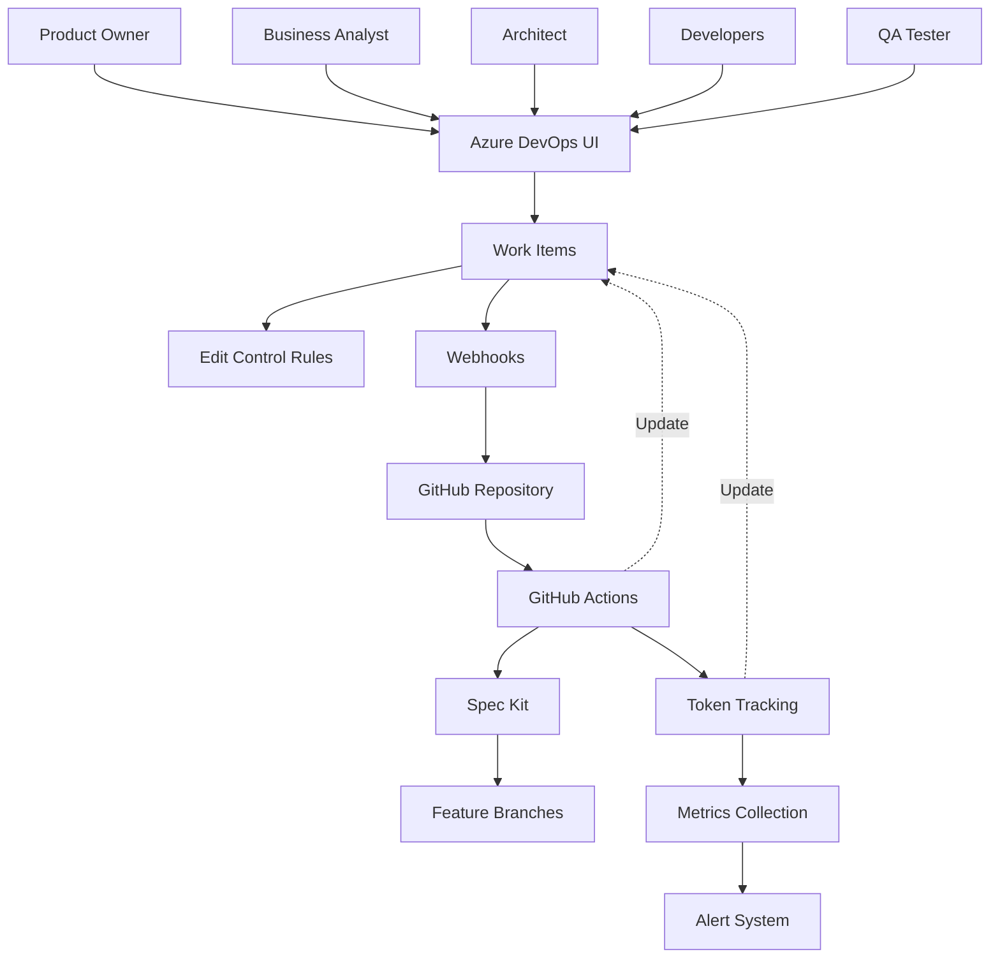

# Architecture Overview

This diagram shows the three main system components and how they interact:
- **Azure DevOps**: Where humans work and manage work items
- **GitHub**: Where AI processing happens via Spec Kit
- **Azure Functions**: Where token usage is monitored
