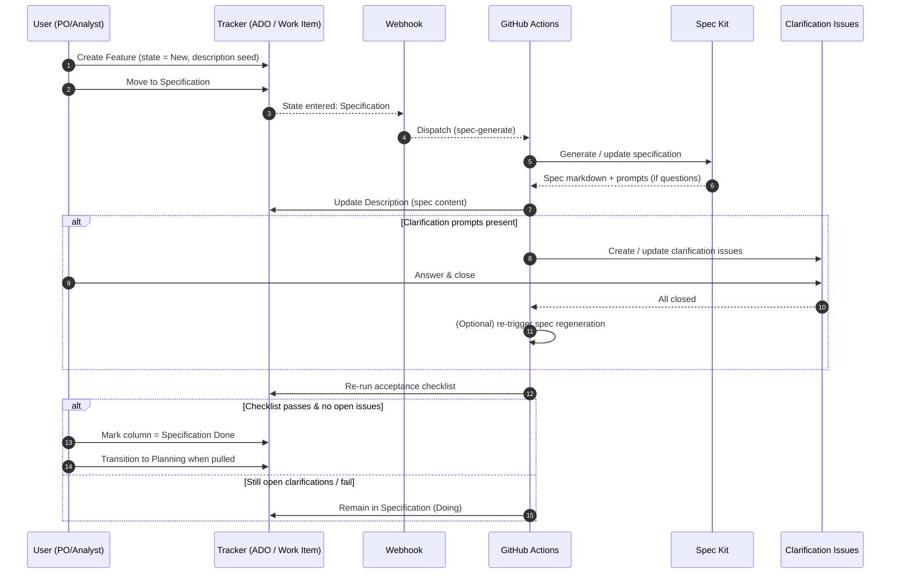

# Data Flow (Lean Specification Loop)

This lean sequence removes transitional micro-states: clarifications live purely as child issues while
the work item remains in `Specification` until exit criteria (no open issues + checklist pass) are met.
