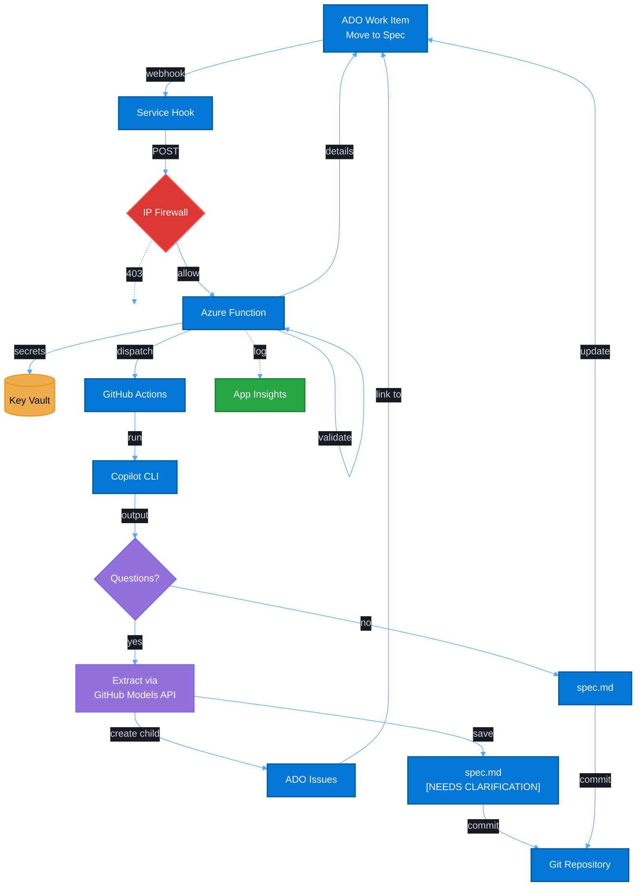

# Data Flow (Specification Automation)

## Flow Phases

### 1. Trigger Phase
- **User moves** work item to "Specification" column in ADO
- **Service Hook** fires `workitem.updated` webhook
- **IP Firewall** validates source IP (deny 403 if not allowlisted)
- **Azure Function** receives validated event

### 2. Azure Phase
- **Validate event**: Check work item type, assignment, column transition
- **Fetch secrets**: Get PATs from Key Vault (Managed Identity)
- **Fetch details**: Get full work item data from ADO API
- **Dispatch workflow**: Trigger GitHub Actions with parameters
- **Log telemetry**: Send metrics to Application Insights

### 3. Generation Phase
- **Copilot CLI** generates specification from feature description
- **LLM Detection**: GitHub Models API analyzes output for questions

### 4. Branching Logic

**If Copilot asked questions:**
1. Extract questions via GitHub Models API (GPT-4o)
2. Create **ADO Issue** work items as children of parent Feature
3. Link Issues to parent Feature work item
4. Save spec with `[NEEDS CLARIFICATION:]` markers
5. Commit to repository
6. **Skip** ADO Description update

**If no questions:**
1. Save clean `spec.md`
2. Commit to repository
3. **Update** ADO work item Description with spec

## Security Configuration

**IP Allowlist**: Function App uses Azure Firewall with:
- Azure DevOps webhook IP ranges (region-specific, from [Microsoft docs](https://learn.microsoft.com/en-us/azure/devops/organizations/security/allow-list-ip-url?view=azure-devops#inbound-connections))
- Deployment source IPs

**Critical Fix Applied (Oct 28, 2025)**: Changed from `AzureDevOps` service tag (outbound connections) to proper inbound IP ranges for Service Hooks. See Terraform `main.tf` for actual configuration.
