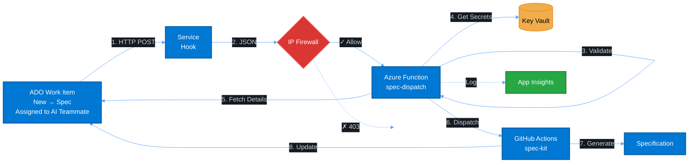

# Data Flow (Specification Automation)

## Data Flow Steps

1. **User Action**: Moves work item to "Specification" column in Azure DevOps and assigns it to AI Teammate
2. **Webhook Trigger**: ADO fires `workitem.updated` event with JSON payload
3. **IP Validation**: Azure Function firewall validates source IP against allowlist
4. **Event Validation**: Function validates:
   - Work item type = Feature
   - Assigned to AI Teammate
   - New column = Specification
5. **Secret Retrieval**: Fetches PATs from Key Vault via Managed Identity
6. **Work Item Fetch**: Gets full work item details from ADO API
7. **Workflow Dispatch**: Triggers GitHub Actions workflow with parameters
8. **Spec Generation**: GitHub Actions runs spec-kit to generate specification
9. **Update ADO**: Updates work item Description field with generated spec
10. **Logging**: All steps logged to Application Insights

## Security Configuration

**IP Allowlist**: Function App uses Azure Firewall with:
- Azure DevOps webhook IP ranges (region-specific, from [Microsoft docs](https://learn.microsoft.com/en-us/azure/devops/organizations/security/allow-list-ip-url?view=azure-devops#inbound-connections))
- Deployment source IPs

**Critical Fix Applied (Oct 28, 2025)**: Changed from `AzureDevOps` service tag (outbound connections) to proper inbound IP ranges for Service Hooks. See Terraform `main.tf` for actual configuration.
