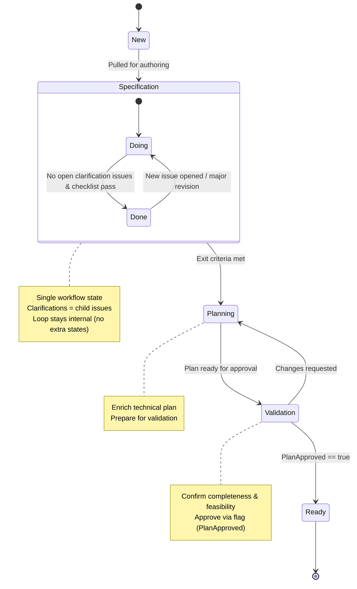

# Lean Feature State Model

Collapsed from legacy multi-step (SpecDraft / Clarify / Ready / PlanValidation / ReadyForDecomp) into a
minimal linear backbone plus an internal loop inside `Specification` using board columns (Doing/Done)
instead of separate workflow states.
