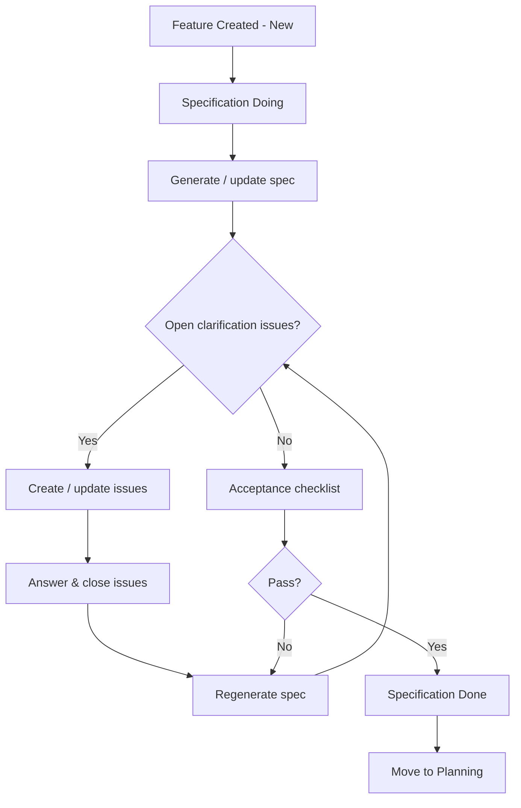

# Specification Clarification Loop (Lean Model)

## Key Points

1. Single workflow state: The work item remains in the single state `Specification` throughout authoring & clarification; only board column changes (Doing -> Done) represent progress.
2. Clarification mechanism: Questions are represented solely as child Clarification Issues (no dedicated Spec Clarify state or custom fields).
3. Loop exit criteria:
     - Zero open Clarification Issues
     - Acceptance checklist passes
     - Description/spec content stabilized (no pending major edits)
4. Transition: When criteria met, card moves to Specification Done column; next action is explicit pull into Planning (changes state to `Planning`).
5. No artificial round cap: Escalation (e.g., to architect) is a human decision if churn persists, not an automated state transition.

## Implementation Notes

- Automation only needs to: (a) create/update Clarification Issues, (b) regenerate spec, (c) optionally flag completion when none remain.
- Avoid adding fields like ClarificationCount or ClarificationStatus unless governance demands metrics; they were intentionally excluded in the lean model.
- Checklist can be a lightweight markdown section inside the Description or a standard Definition of Ready checklist—no separate field required.
