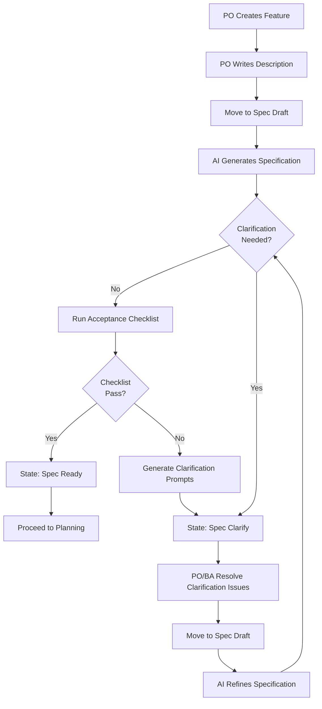

# Specification Clarification Loop

This flowchart details the clarification loop process using child Clarification Issues (lean model: no Clarifications / Questions fields or artificial round limit; architect can still intervene manually if churn persists).
