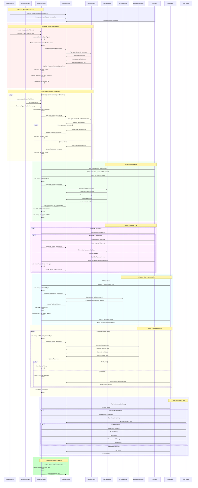

```mermaid
sequenceDiagram
    participant PO as Product Owner
    participant BA as Business Analyst
    participant ADO as Azure DevOps
    participant GH as GitHub Actions
    participant AI_S as AI-SpecAgent
    participant AI_P as AI-PlanAgent
    participant AI_T as AI-TaskAgent
    participant AI_I as AI-ImplementAgent
    participant ARCH as Architect
    participant DEV as Developer
    participant QA as QA Tester

    rect rgb(240, 240, 255)
        Note over PO, ADO: Phase 1: Project Constitution
        PO->>GH: Create constitution.md collaboratively
        BA->>GH: Review and contribute to constitution
        ARCH->>GH: Define technical principles
    end

    rect rgb(255, 240, 240)
        Note over PO, AI_S: Phase 2: Create Specification
        PO->>ADO: Create Feature with POInput
        PO->>ADO: Move to "Spec Draft" column
        ADO->>ADO: Auto-assign to AI:SpecAgent
        ADO->>ADO: Block human edits to specification fields
        ADO-->>GH: Webhook: trigger spec-create
        GH->>AI_S: Run spec-kit specify command
        AI_S->>GH: Create feature branch
        AI_S->>GH: Generate specification.md
        AI_S->>GH: Generate questions.md
        GH-->>ADO: Update Feature with spec & questions
        ADO->>ADO: Set state to "Spec Clarify"
        ADO->>ADO: Create Task items for each question
        ADO->>ADO: Auto-assign to Human:PO
    end

    rect rgb(255, 255, 240)
        Note over PO, AI_S: Phase 3: Specification Clarification
        loop Until no questions remain (max 5 rounds)
            PO->>ADO: Answer questions in Task items
            BA->>ADO: Add clarifications
            PO->>ADO: Move to "Spec Draft" when ready
            ADO->>ADO: Auto-assign to AI:SpecAgent
            ADO-->>GH: Webhook: trigger spec-clarify
            GH->>AI_S: Run spec-kit specify with clarifications
            AI_S->>GH: Update specification
            alt New questions generated
                AI_S->>GH: Create new questions.md
                GH-->>ADO: Update with new questions
                ADO->>ADO: Set state to "Spec Clarify"
            else No questions
                AI_S->>GH: Run acceptance checklist
                GH-->>ADO: Update Feature as complete
                ADO->>ADO: Set state to "Spec Ready"
            end
        end
    end

    rect rgb(240, 255, 240)
        Note over ARCH, AI_P: Phase 4: Create Plan
        ARCH->>ADO: Pull Feature from "Spec Ready"
        ARCH->>ADO: Add architecture guidance & tech stack
        ARCH->>ADO: Move to "Planning" state
        ADO->>ADO: Auto-assign to AI:PlanAgent
        ADO-->>GH: Webhook: trigger plan-create
        GH->>AI_P: Run spec-kit plan command
        AI_P->>GH: Generate contracts.yaml
        AI_P->>GH: Generate datamodel.json
        AI_P->>GH: Generate plan.md
        AI_P->>GH: Generate research.md
        GH-->>ADO: Update Feature with plan artifacts
        ADO->>ADO: Set state to "Plan Validation"
        ADO->>ADO: Auto-assign to Human:Architect
    end

    rect rgb(255, 240, 255)
        Note over ARCH, AI_P: Phase 5: Validate Plan
        loop Until plan approved
            ARCH->>ADO: Review research & plan
            alt Plan needs adjustment
                ARCH->>ADO: Add validation feedback
                ARCH->>ADO: Move back to "Planning"
                ADO-->>GH: Webhook: trigger plan-refine
                GH->>AI_P: Refine plan based on feedback
            else Plan approved
                ARCH->>ADO: Set PlanApproved = true
                ARCH->>ADO: Move to "Ready for Decomposition"
                ADO->>ADO: Auto-create User Stories from spec
                ADO->>GH: Create PR for feature branch
            end
        end
    end

    rect rgb(240, 255, 255)
        Note over DEV, AI_T: Phase 6: Task Decomposition
        DEV->>ADO: Pull User Story
        DEV->>ADO: Move to "Decomposing" state
        ADO->>ADO: Auto-assign to AI:TaskAgent
        ADO-->>GH: Webhook: trigger task-decompose
        GH->>AI_T: Run spec-kit tasks command
        AI_T->>GH: Generate tasks.json with phases
        GH-->>ADO: Create Task work items
        ADO->>ADO: Link Tasks to User Story
        ADO->>ADO: Set User Story to "Tasks Created"
        DEV->>ADO: Review generated tasks
        DEV->>ADO: Move Story to "Implementation"
    end

    rect rgb(255, 255, 240)
        Note over DEV, AI_I: Phase 7: Implementation
        loop For each Task in Story
            ADO->>ADO: Auto-assign task to AI:ImplementAgent
            ADO-->>GH: Webhook: trigger implement
            GH->>AI_I: Run spec-kit implement
            AI_I->>GH: Generate code for task
            AI_I->>GH: Generate unit tests
            AI_I->>GH: Run automated tests
            GH-->>ADO: Update Task status
            alt Tests pass
                ADO->>ADO: Mark Task as "Done"
            else Tests fail
                ADO->>ADO: Assign to Human:Developer
                DEV->>GH: Fix implementation manually
                DEV->>ADO: Mark Task as "Done"
            end
        end
        ADO->>ADO: Move Story to "Testing"
    end

    rect rgb(240, 240, 255)
        Note over DEV, QA: Phase 8: Testing & QA
        DEV->>GH: Test implementation locally
        DEV->>ADO: Add test results
        alt Developer tests pass
            DEV->>ADO: Move Story to "QA Ready"
            QA->>ADO: Pull Story for testing
            QA->>GH: Run acceptance tests
            alt QA tests pass
                QA->>ADO: Move Story to "Done"
            else QA tests fail
                QA->>ADO: Log defects
                QA->>ADO: Move back to "Testing"
                DEV->>GH: Fix defects
            end
        else Developer tests fail
            DEV->>GH: Fix issues
            DEV->>ADO: Retry testing
        end
    end

    rect rgb(200, 255, 200)
        Note over ADO, GH: Throughout: Token Tracking
        GH-->>ADO: Report tokens used per operation
        ADO->>ADO: Update TokensConsumed field
        ADO-->>GH: Log to Azure Function
    end
```