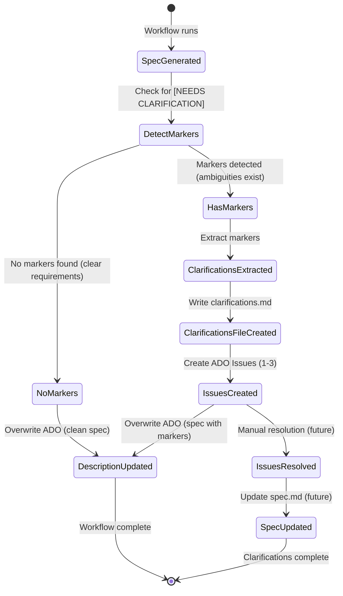

# Data Model: Clarification Questions Workflow Extension

**Feature**: 002-preserve-clarification-questions  
**Version**: 1.0  
**Date**: 2025-11-02

Extends the data model from `001-ado-github-spec/data-model.md` with new entities for clarification question handling.

## New Entities

### Clarifications File (clarifications.md)
- **Location**: `specs/<feature-dir>/clarifications.md` in Git
- **Lifecycle**: Created **only when** spec.md contains [NEEDS CLARIFICATION] markers; removed when all resolved
- **Relationship**: 1:0..1 with Specification Artifact (spec.md) - optional entity, exists only when markers present
- **Content Structure**:
  - Header (feature name, spec link, status)
  - Numbered questions (1-3 max per MVP constraint)
  - Each question: context, question text, answer placeholder
- **State Transitions**:
  - Created → Open (initial state after extraction)
  - Open → Partially Answered (some questions have answers)
  - Partially Answered → Complete (all questions answered)
  - Complete → Archived (merged into spec.md in future enhancement)

### Clarification Marker
- **Format**: `[NEEDS CLARIFICATION: <question text>]`
- **Location**: Inline within spec.md sections
- **Attributes**:
  - Question text (string, max ~200 chars recommended)
  - Position (spec section header where it appears)
  - Topic (auto-extracted from first few words)
  - Priority (implicit: order in spec = descending priority)
- **Extraction Pattern**: `\[NEEDS CLARIFICATION:\s*([^\]]+)\]`
- **Lifecycle**: Created by Copilot during spec generation → Extracted to clarifications.md → Replaced with answer when resolved

### Issue Work Item (Clarification Type)
- **ADO Work Item Type**: Issue (standard type, tagged for identification)
- **Creation Condition**: Only created when [NEEDS CLARIFICATION] markers exist in spec.md
- **Fields**:
  - Title: `"Clarification Q[N]: [topic]"` (N = 1-3)
  - Description: Markdown containing question context, spec file path, GitHub branch link
  - Assigned To: Inherited from Feature "Created By" or unassigned
  - Tags: `["clarification", "auto-generated"]`
  - State: New → Active → Resolved → Closed
  - Parent: Link to originating Feature work item (Parent-Child relationship)
  - Custom Fields (future): `SpecFile` (path), `QuestionNumber` (1-3)
- **Relationship**: N:1 with Feature (N clarifications per 1 Feature, max N=3)
- **Idempotency Key**: Hash of `FeatureID + QuestionPosition` or `FeatureID + QuestionText` to prevent duplicates

## Modified Entities

### Feature (ADO Work Item)
**Changes from baseline**:
- **New Relationship**: 1:0..N with Issue (Clarification) work items via Parent-Child link (0 when no clarifications needed)
- **Description Field**: Now contains spec content from spec.md - with preserved [NEEDS CLARIFICATION] markers if present, or clean spec if no markers (not auto-resolved)
- **Validation Rule**: When child Issues exist, cannot transition from "Specification – Doing" to "Specification – Done" if clarification Issues are still Active

### Specification Artifact (spec.md)
**Changes from baseline**:
- **New Content**: May contain [NEEDS CLARIFICATION] markers after initial generation (not guaranteed - depends on requirement clarity)
- **State Variants**:
  - Draft with markers (when ambiguities detected)
  - Draft resolved (after manual clarification - future)
  - Complete (no markers - clear requirements from start)
- **Relationship**: 1:0..1 with Clarifications File (only when markers present)

### Workflow Dispatch Request
**Changes from baseline**:
- **New Input**: `mode` (optional string: "interactive" | "non-interactive", default: "non-interactive" in GitHub Actions)
- **Behavior Change**: When `mode=non-interactive`, Copilot preserves clarification markers instead of auto-resolving

## Entity Relationships (Extended)

```
Feature (ADO)
  ├─ 1:1 → Specification Artifact (spec.md)
  │         └─ 1:0..1 → Clarifications File (clarifications.md)
  │                       └─ contains → Clarification Markers (1-3)
  └─ 1:N → Issue (Clarification) work items (0-3)
              └─ each corresponds to → 1 Clarification Marker
```

| From Entity | To Entity | Relationship | Cardinality | Notes |
|-------------|-----------|--------------|-------------|-------|
| Feature | Issue (Clarification) | Parent-Child | 1:N (max 3) | Each clarification marker creates 1 Issue |
| Specification Artifact | Clarifications File | Companion | 1:0..1 | File exists only when markers present |
| Clarifications File | Clarification Markers | Contains | 1:N (max 3) | Extracted from spec.md |
| Clarification Marker | Issue (Clarification) | Generates | 1:1 | Each marker → 1 Issue via workflow automation |
| Workflow Run | Issue (Clarification) | Creates | 1:N | Single workflow run creates all Issues for a Feature |

## State Transitions (Extended)



## Validation Rules (Extended)

### Extraction Rules
- Regex pattern MUST match exactly: `\[NEEDS CLARIFICATION:\s*([^\]]+)\]`
- Malformed markers (missing colon, unclosed bracket) logged as warnings, not extracted
- Maximum 3 markers enforced; if >3 detected, keep first 3 by appearance order (assumption: earlier = higher priority)

### Issue Creation Rules
- Issue Title length MUST be ≤255 characters (ADO limit)
- Issue Description MUST include: question text, spec file path, GitHub branch URL
- Parent-Child link MUST succeed; if fails, log error but continue (Issue still created, manual linking required)
- Idempotency: Before creating Issue, query existing Issues with tag "clarification" and parent = FeatureID; skip if duplicate question detected (match on first 50 chars)

### Description Overwrite Rules
- ADO PATCH MUST send spec content including markers (not resolved version)
- Validation: After PATCH, GET Description field and assert contains `[NEEDS CLARIFICATION` substring (if markers were present)

## Persistence & Storage

| Entity | Storage | Durability | Access Pattern |
|--------|---------|------------|----------------|
| Clarifications File | Git repository (feature branch) | Persistent until merged/deleted | Read by PO, updated manually (future) or via automation |
| Clarification Marker | Embedded in spec.md | Persistent until resolved | Parsed by workflow, searched by regex |
| Issue (Clarification) | Azure DevOps database | Persistent | Queried by FeatureID + tags, updated via ADO UI |
| Idempotency Hash | ADO Issue Description (metadata line) or Tags | Persistent | Queried before Issue creation to prevent duplicates |

## Migration Notes

**From 001-ado-github-spec to 002**:
1. No schema changes to existing entities (backward compatible)
2. New entities (clarifications.md, Issue) introduced only when clarification markers present
3. Existing Features without clarifications unaffected
4. Workflow YAML requires new steps (extract markers, create Issues) but existing steps unchanged

**Rollback Strategy**:
- Remove extraction and Issue creation steps from workflow
- Auto-resolution behavior (old) can be restored by removing `PRESERVE_MARKERS=true` flag

---

**Summary**: Data model extends baseline with asynchronous clarification tracking entities; minimal impact on existing Features; adds structured workflow for handling specification ambiguities.
